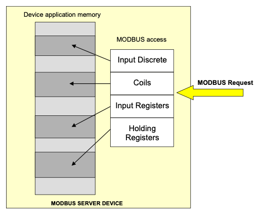
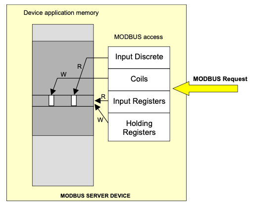

Configuration
=============

Configuring the pymodbus simulator is done with a json file, or if only
using the datastore simulator a python dict (same structure as the
device part of the json file).

Json file layout
----------------

The json file consist of 2 main entries "server_list" (see :ref:`Server entries`) and "device_list" (see :ref:`Device entries`)
each containing a list of servers/devices

.. code-block::

    {
        "server_list": {
            "<name>": { ... },
            ...
        },
        "device_list": {
            "<name>": { ... },
            ...
        }
    }

You can define as many server and devices as you like, when starting
:ref:`pymodbus.simulator` you select one server and one device to simulate.

A entry in “device_list” correspond to the dict you can use as parameter
to datastore_simulator is you want to construct your own simulator.

Server entries
--------------

The entries for a tcp server with minimal parameters look like:

.. code-block::

   {
        "server_list": {
            "server": {
                "comm": "tcp",
                "host": "0.0.0.0",
                "port": 5020,
                "allow_reuse_address": true,
                "framer": "socket",
            }
        }
        "device_list": {
            ...
        }
   }

The example uses ``“comm”: “tcp”``, so the entries are arguments to :class:`pymodbus.server.ModbusTcpServer`, where detailed information are available.

The entry “comm” allows the following values:

- “serial”, to use :class:`pymodbus.server.ModbusSerialServer`,
- “tcp”, to use :class:`pymodbus.server.ModbusTcpServer`,
- “tls”, to use :class:`pymodbus.server.ModbusTlsServer`,
- “unix”, to use :class:`pymodbus.server.ModbusUnixServer`,
- “udp”;  to use :class:`pymodbus.server.ModbusUdpServer`.

The entry “framer” allows the following values:

- “ascii” to use :class:`pymodbus.framer.ascii_framer.ModbusAsciiFramer`,
- "binary to use :class:`pymodbus.framer.ascii_framer.ModbusBinaryFramer`,
- “rtu” to use :class:`pymodbus.framer.ascii_framer.ModbusRtuFramer`,
- “tls” to use :class:`pymodbus.framer.ascii_framer.ModbusTlsFramer`,
- “socket” to use :class:`pymodbus.framer.ascii_framer.ModbusSocketFramer`.

.. warning::

    not all "framer" types can be used with all “comm” types.

    e.g. ``"framer": “tls”`` only works with ``“comm”: “tls”``!

Server configuration examples
-----------------------------
.. code-block::

    {
       "server_list": {
            "server": {
                "comm": "tcp",
                "host": "0.0.0.0",
                "port": 5020,
                "allow_reuse_address": true,
                "ignore_missing_slaves": false,
                "framer": "socket",
                "identity": {
                    "VendorName": "pymodbus",
                    "ProductCode": "PM",
                    "VendorUrl": "https://github.com/riptideio/pymodbus/",
                    "ProductName": "pymodbus Server",
                    "ModelName": "pymodbus Server",
                    "MajorMinorRevision": "3.1.0"
                }
            },
            "server_try_serial": {
                "comm": "serial",
                "port": "/dev/tty0",
                "stopbits": 1,
                "bytesize": 8,
                "parity": "N",
                "baudrate": 9600,
                "timeout": 3,
                "auto_reconnect": false,
                "reconnect_delay": 2,
                "framer": "rtu",
                "identity": {
                    "VendorName": "pymodbus",
                    "ProductCode": "PM",
                    "VendorUrl": "https://github.com/riptideio/pymodbus/",
                    "ProductName": "pymodbus Server",
                    "ModelName": "pymodbus Server",
                    "MajorMinorRevision": "3.1.0"
                }
            },
            "server_try_tls": {
                "comm": "tls",
                "host": "0.0.0.0",
                "port": 5020,
                "certfile": "certificates/pymodbus.crt",
                "keyfile": "certificates/pymodbus.key",
                "allow_reuse_address": true,
                "backlog": 20,
                "ignore_missing_slaves": false,
                "framer": "tls",
                "identity": {
                    "VendorName": "pymodbus",
                    "ProductCode": "PM",
                    "VendorUrl": "https://github.com/riptideio/pymodbus/",
                    "ProductName": "pymodbus Server",
                    "ModelName": "pymodbus Server",
                    "MajorMinorRevision": "3.1.0"
                }
            },
            "server_test_try_udp": {
                "comm": "udp",
                "host": "0.0.0.0",
                "port": 5020,
                "ignore_missing_slaves": false,
                "framer": "socket",
                "identity": {
                    "VendorName": "pymodbus",
                    "ProductCode": "PM",
                    "VendorUrl": "https://github.com/riptideio/pymodbus/",
                    "ProductName": "pymodbus Server",
                    "ModelName": "pymodbus Server",
                    "MajorMinorRevision": "3.1.0"
                }
            }
        }
    }

Device entries
--------------

Each device is configured in a number of sections, described in detail below

- "setup", defines the overall structure of the device, like e.g. number of registers,
- "invalid", defines invalid registers and causes a modbus exception when reading and/or writing,
- "write", defines registers which allow read/write, other registers causes a modbus exception when writing,
- "bits", defines registers which contain bits (discrete input and coils),
- "uint16", defines registers which contain a 16 bit unsigned integer,
- "uint32", defines sets of registers (2) which contain a 32 bit unsigned integer,
- "float32", defines sets of registers (2) which contain a 32 bit float,
- "string", defines sets of registers which contain a string,
- "repeat", is a special command to copy configuration if a device contains X bay controllers, configure one and use repeat for X-1.

The datastore simulator manages the registers in a big list, which can be manipulated with

- actions (functions that are called with each access)
- manually via the WEB interface
- automated via the REST API interface
- the client (writing values)

It is important to understand that the modbus protocol does not know or care how the physical memory/registers are organized, but it has a huge impact on the client!

Communication with a modbus device is based on registers which each contain 16 bits (2 bytes). The requests are grouped in 4 groups

- Input Discrete
- Coils
- Input registers
- Holding registers

The 4 blocks are mapped into physical memory, but the modbus protocol makes no assumption or demand on how this is done.

The history of modbus devices have shown 2 forms of mapping.

The first form is also the original form. It originates from a time where the devices did not contain memory, but the request was mapped directly to a physical sensor:

When reading holding register 1 (block 4) you get a different register as when reading input register 1 (block 1).
Each block references a different physical register memory, in other words the size of the needed memory is the sum of the block sizes.

The second form uses 1 shared block, most modern devices use this form for 2 main reasons:

- the modbus protocol implementation do not connect directly to the sensors but to a shared memory controlled by a small microprocessor.
- designers can group related information independent of type (e.g. a bay controller with register 1 as coil, register 2 as input and register 3 as holding)

When reading holding register 1 the same phyical register is accessed as when reading input register 1.
Each block references the same physical register memory, in other words the size of the needed memory is the size of the largest block.

The datastore simulator supports both types.

Setup section
^^^^^^^^^^^^^

Example "setup" configuration:

.. code-block::

    "setup": {
        "co size": 10,
        "di size": 20,
        "hr size": 15,
        "ir size": 25,
        "shared blocks": true,
        "type exception": true,
        "defaults": {
            "value": {
                "bits": 0,
                "uint16": 0,
                "uint32": 0,
                "float32": 0.0,
                "string": " "
            },
            "action": {
                "bits": null,
                "uint16": "register",
                "uint32": "register",
                "float32": "register",
                            "string": null
            }
    }

**"co size"**, **"di size"**, **"hr size"**, **"ir size"**:

    Define the size of each block.
    If using shared block the register list size will be the size of the biggest block (25 reegisters)
    If not using shared block the register list size will be the sum of the 4 block sizes (70 registers).

**"shared blocks"**

    Defines if the blocks are independent or shared (true)

**"type exception"**

    Defines is the server returns a modbus exception if a read/write request violates the specified type.
    E.g. Read holding register 10 with count 1, but the 10,11 are defined as UINT32 and thus can only be read with multiples of 2.

    This feature is designed to control that a client access the device in the manner it was designed.

**"defaults"**

    Defines how to defines registers not configured or or only partial configured.

    **"value"** defines the default value for each type.

    **"action"** defines the default action for each type.
    Actions are functions that are called whenever the register is accessed and thus allows automatic manipulation.

The datastore simulator have a number of builtin actions, and allows custom actions to be added:

- **"random"**, change the value with every access,
- **"increment"**, increment the value by 1 with every access,
- **"timestamp"**, uses 6 registers and build a timestamp,
- **"reset"**, causes a reboot of the simulator,
- **"uptime"**, sets the number of seconds the server have been running.

Invalid section
^^^^^^^^^^^^^^^

Example "invalid" configuration:

.. code-block::

    "invalid": [
        5,
        [10, 15]
    ],

Defines invalid registers which cannot be read or written. When accessed the response in a modbus exception **invalid address**.
In the example registers 5, 10, 11, 12, 13, 14, 15 will produce an exception response.

Registers can be singulars (first entry) or arrays (second entry)

Write section
^^^^^^^^^^^^^

Example "write" configuration:

.. code-block::

    "write": [
        4,
        [5, 6]
    ],

Defines registers which can be written to. When writing to registers not defined here the response is a modbus exception **invalid address**.

Registers can be singulars (first entry) or arrays (second entry)

Bits section
^^^^^^^^^^^^

Example "bits" configuration:

.. code-block::

    "bits": [
        5,
        [6, 7],
        {"addr": 8, "value": 7},
        {"addr": 9, "value": 7, "action": "random"},
        {"addr": [11, 12], "value": 7, "action": "random"}
    ],

defines registers which contain bits (discrete input and coils),

Registers can be singulars (first entry) or arrays (second entry),
furthermore a value and/or a action can be defined,
the value and/or action is inserted into each register defined in "addr".

Uint16 section
^^^^^^^^^^^^^^

Example "uint16" configuration:

.. code-block::

    "uint16": [
        5,
        [6, 7],
        {"addr": 8, "value": 30123},
        {"addr": 9, "value": 712, "action": "increment"},
        {"addr": [11, 12], "value": 517, "action": "random"}
    ],

defines registers which contain a 16 bit unsigned integer,

Registers can be singulars (first entry) or arrays (second entry),
furthermore a value and/or a action can be defined,
the value and/or action is inserted into each register defined in "addr".

Uint32 section
^^^^^^^^^^^^^^

Example "uint32" configuration:

.. code-block::

    "uint32": [
        [6, 7],
        {"addr": [8, 9], "value": 300123},
        {"addr": [10, 13], "value": 400712, "action": "increment"},
        {"addr": [14, 15], "value": 500517, "action": "random"}
    ],

defines sets of registers (2) which contain a 32 bit unsigned integer,

Registers can only be arrays in multiples of 2,
furthermore a value and/or a action can be defined,
the value and/or action is converted (high/low value) and inserted into each register set defined in "addr".

Float32 section
^^^^^^^^^^^^^^^

Example "float32" configuration:

.. code-block::

    "float32": [
        [6, 7],
        {"addr": [8, 9], "value": 3123.17},
        {"addr": [10, 13], "value": 712.5, "action": "increment"},
        {"addr": [14, 15], "value": 517.0, "action": "random"}
    ],

defines sets of registers (2) which contain a 32 bit float,

Registers can only be arrays in multiples of 2,
furthermore a value and/or a action can be defined,
the value and/or action is converted (high/low value) and inserted into each register set defined in "addr".

Remark remember to set ``"value": <float value>`` like 512.0 (float) not 512 (integer).

String section
^^^^^^^^^^^^^^

Example "float32" configuration:

.. code-block::

    "string": [
        7,
        [8, 9],
        {"addr": [16, 20], "value": "A_B_C_D_E_"}
    ],

defines sets of registers which contain a string,

Registers can be singulars (first entry) or arrays (second entry). Important each string must be defined individually.

- Entry 1 is a string of 2 chars,
- Entry 2 is a string of 4 chars,
- Entry 3 is a string of 10 chars with the value ''A_B_C_D_E\_''.

Repeat section
^^^^^^^^^^^^^^

Example "repeat" configuration:

.. code-block::

    "repeat": [
        {"addr": [0, 2], "to": [10, 11]},
        {"addr": [0, 2], "to": [10, 15]},
    ]

is a special command to copy configuration if a device contains X bay controllers, configure one and use repeat for X-1.

First entry copies registers 0-2 to 10-11, resulting in 10 == 0, 11 == 1, 12 unchanged.

Second entry copies registers 0-2 to 10-15, resulting in 10 == 0, 11 == 1, 12 == 2, 13 == 0, 14 == 1, 15 == 2, 16 unchanged.

Device configuration examples
-----------------------------

.. code-block::

    {
        "server_list": {
            ...
        },
        "device_list": {
            "device": {
                "setup": {
                    "co size": 63000,
                    "di size": 63000,
                    "hr size": 63000,
                    "ir size": 63000,
                    "shared blocks": true,
                    "type exception": true,
                    "defaults": {
                        "value": {
                            "bits": 0,
                            "uint16": 0,
                            "uint32": 0,
                            "float32": 0.0,
                            "string": " "
                        },
                        "action": {
                            "bits": null,
                            "uint16": "register",
                            "uint32": "register",
                            "float32": "register",
                            "string": null
                        }
                    }
                },
                "invalid": [
                    1
                ],
                "write": [
                    5
                ],
                "bits": [
                    {"addr": 2, "value": 7}
                ],
                "uint16": [
                    {"addr": 3, "value": 17001},
                    2100
                ],
                "uint32": [
                    {"addr": 4, "value": 617001},
                    [3037, 3038]
                ],
                "float32": [
                    {"addr": 6, "value": 404.17},
                    [4100, 4101]
                ],
                "string": [
                    5047,
                    {"addr": [16, 20], "value": "A_B_C_D_E_"}
                ],
                "repeat": [
                ]
            },
            "device_try": {
                "setup": {
                    "co size": 63000,
                    "di size": 63000,
                    "hr size": 63000,
                    "ir size": 63000,
                    "shared blocks": true,
                    "type exception": true,
                    "defaults": {
                        "value": {
                            "bits": 0,
                            "uint16": 0,
                            "uint32": 0,
                            "float32": 0.0,
                            "string": " "
                        },
                        "action": {
                            "bits": null,
                            "uint16": "register",
                            "uint32": "register",
                            "float32": "register",
                            "string": null
                        }
                    }
                },
                "invalid": [
                    [0, 5],
                    77
                ],
                "write": [
                    10,
                    [61, 76]
                ],
                "bits": [
                    10,
                    1009,
                    [1116, 1119],
                    {"addr": 1144, "value": 1},
                    {"addr": [1148,1149], "value": 32117},
                    {"addr": [1208, 1306], "action": "random"}
                ],
                "uint16": [
                    11,
                    2027,
                    [2126, 2129],
                    {"addr": 2164, "value": 1},
                    {"addr": [2168,2169], "value": 32117},
                    {"addr": [2208, 2306], "action": null}
                ],
                "uint32": [
                    12,
                    3037,
                    [3136, 3139],
                    {"addr": 3174, "value": 1},
                    {"addr": [3188,3189], "value": 32514},
                    {"addr": [3308, 3406], "action": null},
                    {"addr": [3688, 3878], "value": 115, "action": "increment"}
                ],
                "float32": [
                    14,
                    4047,
                    [4146, 4149],
                    {"addr": 4184, "value": 1},
                    {"addr": [4198,4191], "value": 32514.1},
                    {"addr": [4308, 4406], "action": null},
                    {"addr": [4688, 4878], "value": 115.7, "action": "increment"}
                ],
                "string": [
                    {"addr": [16, 20], "value": "A_B_C_D_E_"},
                    5047,
                    [5146, 5149],
                    {"addr": [529, 544], "value": "Brand name, 32 bytes...........X"}
                ],
                "repeat": [
                    {"addr": [0, 999], "to": [10000, 10999]},
                    {"addr": [10, 1999], "to": [11000, 11999]}
                ]
            }
        },
        "device_minimum": {
                "setup": {
                    "co size": 10,
                    "di size": 10,
                    "hr size": 10,
                    "ir size": 10,
                    "shared blocks": true,
                    "type exception": false,
                    "defaults": {
                        "value": {
                            "bits": 0,
                            "uint16": 0,
                            "uint32": 0,
                            "float32": 0.0,
                            "string": " "
                        },
                        "action": {
                            "bits": null,
                            "uint16": null,
                            "uint32": null,
                            "float32": null,
                            "string": null
                        }
                    }
                },
                "invalid": [],
                "write": [],
                "bits": [],
                "uint16": [
                    [0, 9]
                ],
                "uint32": [],
                "float32": [],
                "string": [],
                "repeat": []
            }
        }
    }

Configuration used for test
---------------------------

.. literalinclude:: ../../../../pymodbus/server/simulator/setup.json
